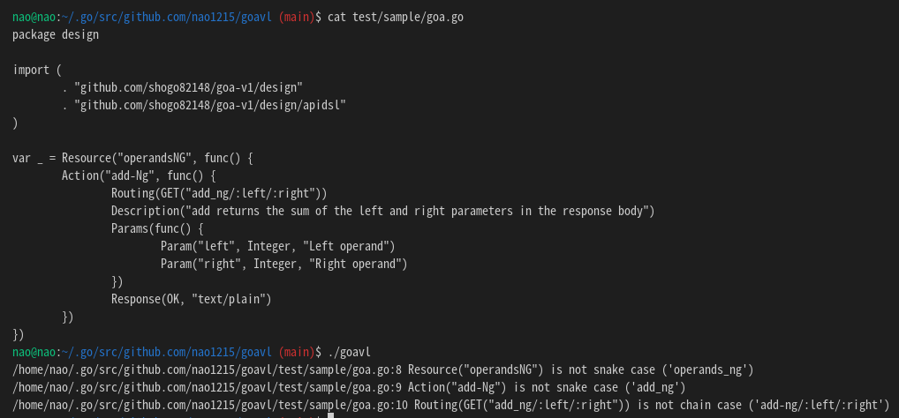

# Work in progress. Don't use this command.
# goavl: Goa framework (ver1) linter

This repository is [forked goa-v1](https://github.com/shogo82148/goa-v1) linter project.

Only Version 1 is supported, Version 3 is not supported.

# Progress of implement
- Add check argument name of Resource().
- Add check argument name of Action().

 